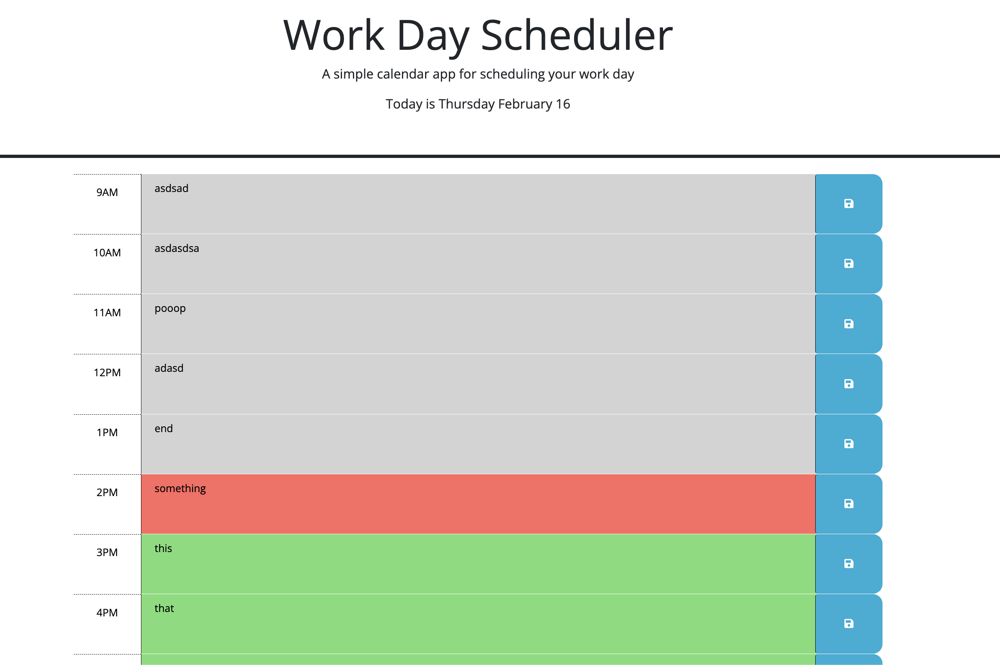

# Day Planner

## Description

This page is an interactive tool to help you plan your day. To design it, I used JQuery methods to allow users to input data and save to local storage, as well as connecting to JSday to bring in the current time and update the page to stay current!

## Installation

Installation for this webpage is not necessary, the deployed website can be viewed at: https://moviefan322.github.io/day-planner/

## Usage

Simply naviate to the following URL and start logging your day: https://moviefan322.github.io/day-planner/

## Credits

Starter code was provided by the bootcamp program, I added event listeners and brought on JSDay, as well as linking to local storage.

## License

MIT Licence
